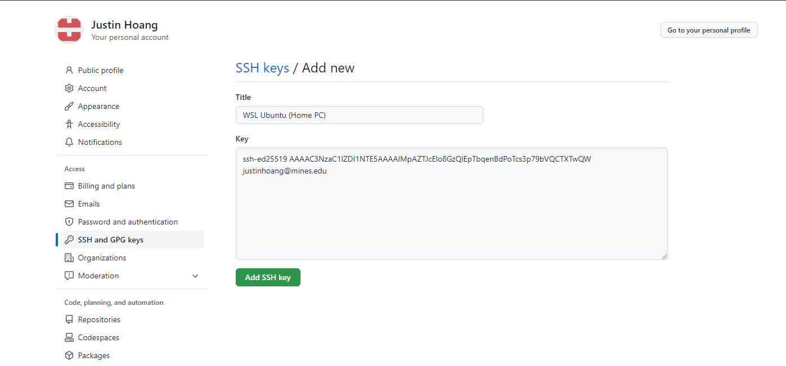

# GitHub

- [Introduction](#introduction)
- [Setup](#setup)
  - [Create An Account](#create-an-account)
  - [Connect Your Computer](#connect-your-computer)
- [Footnotes](#footnotes)

## Introduction

GitHub is the place where all of your `git` repositories will be stored online

Here's what you need to know:

- FREE
  - A pro subscription is **free** [if you are enrolled in university](https://education.github.com/students)
- Portability
  - Your work can be accessed anywhere
  - Collaboration is easy
- Sharing
  - Show off your work!
- The Standard
  - Share your GitHub with your employer

## Setup

### Create An Account

Let's begin by signing up.

1. Go to [github.com](https://github.com/).

   

2. Click the _sign up_ button, then enter an email and password.

   

   Don't worry: you can change the email, password, and username later if you don't like them.

   Follow along with the GitHub account setup but don't worry too much about what you fill out.

3. You're done!

   

   This is the screen you should be greeted with.

### Connect Your Computer

GitHub needs to know that your computer is authorized to access information from your account.

One way to authorize a computer is via [ssh](https://www.geeksforgeeks.org/introduction-to-sshsecure-shell-keys/), which is a network protocol to transfer encrypted data.

Here is the rundown:

- You can access servers or other computers via the command line
- However, you need authorization via an SSH key, which is a fancy way of saying password
- Don't worry too much about how this works, unless you want to get into cybersecurity

1. Generate an SSH key

   ```bash
   # Generate SSH key on local computer
   # Remember to replace <youremail> (no carets)
   ssh-keygen -t ed25519 -C <youremail>
   ```
  
   When prompted by the console, accept all of the default options by clicking enter. Don't worry about setting a password or anything.

   Here is an example run.

   ```console
   09:44:04 sua@JustinPC github ±|1-github-readme ✗|→ ssh-keygen -t ed25519 -C justinhoang@mines.edu

   Generating public/private ed25519 key pair.
   Enter file in which to save the key (/home/sua/.ssh/id_ed25519):
   Enter passphrase (empty for no passphrase):
   Enter same passphrase again:
   Your identification has been saved in /home/sua/.ssh/id_ed25519
   Your public key has been saved in /home/sua/.ssh/id_ed25519.pub
   The key fingerprint is:
   SHA256:CLjzYvagE+JMffpPrJ7tmt2maQdOpfxxHRjvOoFOQxk justinhoang@mines.edu
   The key's randomart image is:
   +--[ED25519 256]--+
   |                 |
   |   .     E .     |
   |  . .     o +    |
   |   . . . + . o   |
   |  +   o S . o .  |
   |o. + ..= = o o   |
   |=.= + oo= + o    |
   |.* =  Boo= o     |
   |..  +B=B+.  .    |
   +----[SHA256]-----+
   ```

2. Add the SSH key to GitHub

   ```bash
   # GitHub -> Settings -> SSH and GPG keys -> New SSH Key
   # Copy and paste this
   cat ~/.ssh/id_ed25519.pub
   ```

   Here is a sample output.

   ```console
   09:47:49 sua@JustinPC github ±|1-github-readme ✗|→ cat ~/.ssh/id_ed25519.pub
   ssh-ed25519 AAAAC3NzaC1lZDI1NTE5AAAAIMpAZTJcElo8GzQlEpTbqenBdPoTcs3p79bVQCTXTwQW justinhoang@mines.edu
   ```

   Go to your GitHub settings, then click on the SSH and GPG Keys section.

   

   

   Give your key a good title, then copy and paste the output into the field.

3. Verify that the key is connected

```bash
# Connects to the GitHub servers via SSH
ssh git@github.com
```

When prompted, say yes to continue connecting.

```console
09:48:51 sua@JustinPC github ±|1-github-readme ✗|→ ssh git@github.com
The authenticity of host 'github.com (140.82.113.4)' can't be established.
ECDSA key fingerprint is SHA256:p2QAMXNIC1TJYWeIOttrVc98/R1BUFWu3/LiyKgUfQM.
Are you sure you want to continue connecting (yes/no/[fingerprint])? yes
Warning: Permanently added 'github.com,140.82.113.4' (ECDSA) to the list of known hosts.
PTY allocation request failed on channel 0
Hi suasuasuasuasua! You've successfully authenticated, but GitHub does not provide shell access.
Connection to github.com closed.
```

This is the line that you should look out for "_Hi suasuasuasuasua!_", where suasuasuasuasua should be your own username.

This is the final check that your computer is registered and authorized to access your account on GitHub.

Here are the new privileges:

- You are now allowed to clone, push, and pull from your own public and private repositories
  - When cloning private repos, GitHub requires authorization
  - For both, you need authorization to push and pull, either from a username/password or SSH verification
- You will never be prompted your a password again, unless you delete the key or work on a new computer.[^1]

<!-- TODO Move these to GitHub section -->

<!-- TODO Link to GitHub section -->

<!-- ### Creating Repos on GitHub

1. Go to [GitHub](github.com).
2. Click _new_ repo on the top left.
3. Give the repository a name.
4. Make it public or private (be smart)
5. Click create repository -->

<!-- ### Cloning Repos

```bash
# Get the SSH link from Github (NOT THE HTTP ONE)
git clone git@github.com:<username>/<repo-name>.git
``` -->

<!-- ### Pushing and Pulling Changes

```bash
# Connect local repo to the remote repository on GitHub
# Grab this link from GitHub Repo > SSH > link
git remote add origin git@github.com:<username>/<repo-name>.git
# Set upstream branch so that we can push LOCAL changes to REMOTE repository
# Might be main or master
git push --set-upstream origin main
# OR
git push origin main
``` -->

<!-- TODO Move these to GitHub section END -->

---

## Footnotes

[^1]: Though [even passwords](https://www.geekersdigest.com/github-deprecation-notice-switching-from-password-to-token-authentication/) aren't allowed.
