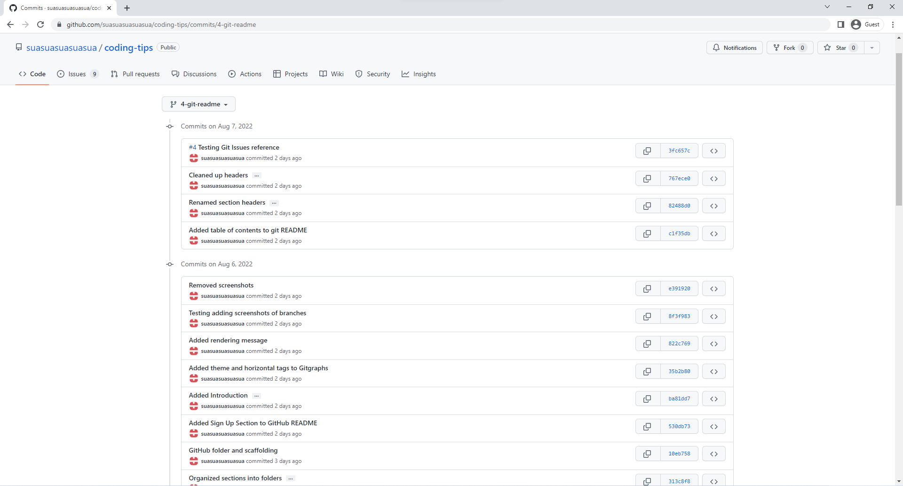
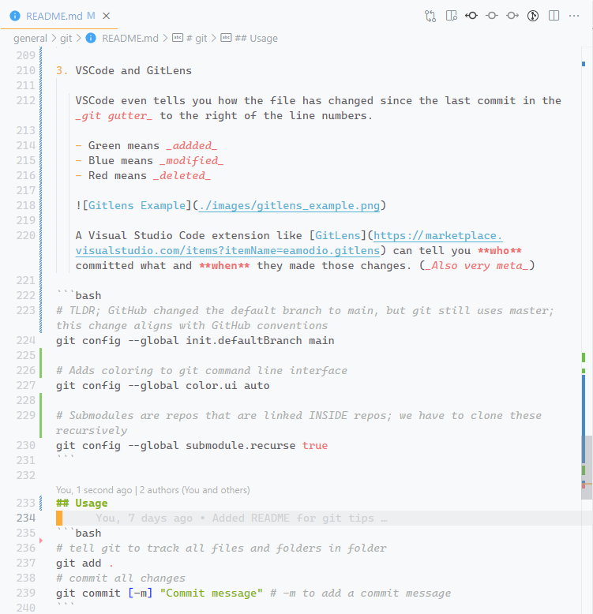
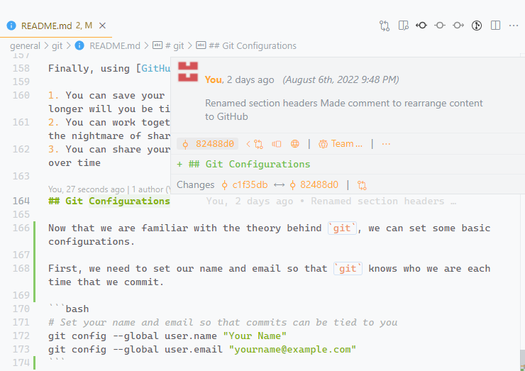

# git

- [Introduction](#introduction)
  - [Visualization](#visualization)
    - [Basic](#basic)
    - [Branching](#branching)
    - [Website Example](#website-example)
  - [Takeaways](#takeaways)
- [Git Configurations](#git-configurations)
  - [Update](#update)
  - [Identification](#identification)
  - [General](#general)
- [Usage](#usage)
  - [The Staging Process](#the-staging-process)
  - [Initializing a git repository](#initializing-a-git-repository)
  - [Tracking Files](#tracking-files)
  - [Putting it All Together](#putting-it-all-together)
  - [.gitignore](#gitignore)
- [Footnotes](#footnotes)

## Introduction

`git` is known as a version control system or VCS.

As developers, we use `git` to track changes to our projects over time.

To highlight, you can:

- Mark important points in development
- Revert to previous stages in the codebase easily
- Visualize how the project changes over time

### Visualization

The greatest strength of `git` is that we can develop _incrementally_ by committing small changes over time. We can **checkout** any commit to browse the codebase at that moment in time, like a _snapshot_.

The place where we store our code is called `git` repository, or a repo for short.

#### Basic

Consider this basic git repo.

```mermaid
%%{init: { 'logLevel': 'debug', 'theme': 'base', 'gitGraph': {'rotateCommitLabel': true}} }%%
gitGraph
  commit
  commit
  commit
  commit
  commit
  commit
```

Here are the highlights:

- The `main` branch holds all of the code
- There are six nodes on the `main` branch; these are called **commits**
  - Commits are _snapshots_ of your repo at that moment in time
  - The files are _just as they were_ at the moment you committed
- The ID under each commit is a unique, generated commit identifier
  - For the curious, `git` calculates these IDs by [hashing](https://ericsink.com/vcbe/html/cryptographic_hashes.html#:~:text=Git%20uses%20hashes%20in%20two,computed%20when%20it%20was%20stored.) many different factors to ensure [uniqueness](https://stackoverflow.com/a/34764586) between commits.
  - `git` also uses hashing to _figure_ out when files have been created, modified, or deleted.
  - Don't worry too much about the details because you probably won't need to know.

#### Branching

This repo is a little more interesting from the previous.

```mermaid
%%{init: { 'logLevel': 'debug', 'theme': 'base', 'gitGraph': {'rotateCommitLabel': true}} }%%
gitGraph
  commit id: "changed something"
  commit id: "changed something else"
  branch testing
  commit id: "testing something"
  commit id: "testing another thing"
  checkout main
  commit id: "testing another feature"
  merge testing
  commit id: "merged testing"
```

Here are the highlights:

- In addition to a unique ID on each commit, `git` requires a message each time
  - However, what the message contains is not regulated
- Look at the tags and tell me what's going on between each commit
  - It's hard without looking at the code, which is tedious because you could have changed a million lines across hundreds of files
  - No matter how big or small the change is, all commit _look_ the same from the surface
  - Basically, you'll hate your life, you'll hate your team, or your team will hate you
- Here, there are two branches: `main` and `testing`
- There are two commits to the `main` branch, then `testing` branch is created
  - `testing` is created **based on** the second commit of `main`
  - `testing` now has all the same files as the second commit from `main`
- Now, `main` and `testing` can commit **independently**
  - The changes in `main` are not seen in `testing`
- Near the end, the two branches are **merged** together
  - Changes from `testing` are combined into `main`
  - Watch out! There could be **merge conflicts**, so we'll have to reconcile those
- Finally, `main` is the last branch

#### Website Example

Let's say we're creating a simple website.

The `git` repo might look like the following.

```mermaid
%%{init: { 'logLevel': 'debug', 'theme': 'base', 'gitGraph': {'rotateCommitLabel': true}} }%%
gitGraph
  commit id: "Initial Setup"
  commit id: "Added Scaffolding to Website"
  branch buttons
  commit id: "Added Button Scaffolding"
  branch animations
  commit id: "Animation Scaffolding"
  checkout buttons
  commit id: "Added Styling to Button"
  commit id: "Added Sound to Button"
  checkout main
  commit id: "Created Basic CSS"
  branch index
  commit id: "Filled in About Me Section"
  commit id: "Added Portfolio"
  checkout main
  merge index
  checkout buttons
  commit id: "Added Functionality"
  checkout main
  merge buttons
```

Here's the breakdown:

- Before anything, note that all of the commits have descriptive messages
  - The purpose of each commit is easily understood
- We begin on `main` as usual
- `buttons` is created based on the beginning stages of `main`
  - Commits are created here **specifically for buttons**
- `animations` is created based on `buttons`
  - `animations` ends there
  - Branches **do not** have to be merged back into `main`
  - These are called **dead branches**
- `index` is created the third commit of `main`
  - Note that `buttons` is created on the second commit of `main`
  - `index` is only for work on the main page
- `buttons` and `index` are merged into `main`
  - Note that we do this one by one[^1]

### Takeaways

The main takeaway is that `git` can help us develop efficiently.

By making small commits over time, we can always revert to working code, if we ever mess up (which we are bound to do).

Along this line, we can mark meaningful moments in time, so we don't go crazy wondering what we were doing a day ago, a week ago, a month ago, or even a year ago.

Also, branching can help us work organize and compartmentalize our work, making it easier to track what needs to be done.

Finally, using [GitHub](../github/), a couple important things are possible:

1. You can save your work online, then sync your code across many machines; no longer will you be tied down to one computer
2. You can work together with friends, students, or coworkers; you can avoid the nightmare of sharing files via Google Drive or email (_shudder_)
3. You can share your work and take pride in how your projects have developed over time

## Git Configurations

Now that we are familiar with the theory behind `git`, we can set some basic configurations.

### Updates

```bash
# Ubuntu/Debian doesn't have the latest version of git in their default packaging system
# We'll add git's official stream, which contains up-to-date versions of git
sudo add-apt-repository ppa:git-core/ppa

# Retrieves new packages, then install them
sudo apt update && sudo apt upgrade
```

### Identification

First, we need to set our name and email so that `git` knows who we are each time that we commit.

```bash
# Set your name and email so that commits can be tied to you
git config --global user.name "Your Name"
git config --global user.email "yourname@example.com"
```

Here is the commit history seen in three ways.

1. `git log`

   ```console
   sua@JustinPC:$ git log

   commit 767ece0574ee737b2f9332a1193d7106adebcc9d
   Author: Justin Hoang <justinhoang@mines.edu>
   Date:   Sat Aug 6 22:52:02 2022 -0500

       Cleaned up headers
       TOC looking more accurate

   commit 82488d06487770f16a957f5f8a54ee69faa8a590
   Author: Justin Hoang <justinhoang@mines.edu>
   Date:   Sat Aug 6 22:48:01 2022 -0500

       Renamed section headers
       Made comment to rearrange content to GitHub
   :
   ```

   `git log` is the console command that you run. It's a little hard to digest, but it contains all of the essential information.

2. GitHub

   

   Here on GitHub, you can see the commits, as well as the messages and timestamps for each one. It's also a little easier to digest and understand what was going on.

   On each commit, you can copy the commit hash code, check what files were added, changed, or deleted, and browse the repository **at that point in time**.

   In fact, note the branch **4-git-readme**; this is the branch that I created **just** to scaffold and build this page. (_Very meta_).

3. VSCode and GitLens

   

   VSCode even tells you how the file has changed since the last commit in the _git gutter_ to the right of the line numbers.

   - Green means _added_
   - Blue means _modified_
   - Red means _deleted_

   However, VSCode doesn't tell you much information past those three indicators, which is where an VSCode extension called GitLens comes in.

   

   [GitLens](https://marketplace.visualstudio.com/items?itemName=eamodio.gitlens) can tell you **who** committed what and **when** they made those changes. (_Also very meta_)

### General

These are some more useful general configurations.

```bash
# TLDR; GitHub changed the default branch to main, but git still uses master; this change aligns with GitHub conventions
git config --global init.defaultBranch main

# Adds coloring to git command line interface
git config --global color.ui auto

# Submodules are repos that are linked INSIDE repos; we have to clone these recursively
git config --global submodule.recurse true
```

## Usage

Before we can begin using `git`, there is a little more theory to know about.

### The Staging Process


In a `git` repo, there are four kinds of files.

- Untracked
  - New files
- Unmodified
  - Files already being tracked by `git`, but have **no changes**
- Modified
  - Files already being tracked by `git`, but have **changes**
- Staged
  - Files that are ready to be committed

### Initializing a git repository

To create a `git` repository, type the following in a directory.

```bash
# Initialize a git repo in the current directory
git init
```

### Tracking Files

```bash
# Tell git to add all files to staging area
# The staging area is where files are "waiting" to be committed
git add .

# Or you can add specific files and folders, though using '.'  is convention
git add file1
git add folder1
````

### Committing Changes

```bash
# Commit all changes
git commit [-m] "Commit message" # -m to add a commit message
```

### Putting it All Together

Let's create a `git` repo called `test-repo`

```console
sua@JustinPC:$ Documents → mkdir test-repo
mkdir: created directory 'test-repo'
sua@JustinPC:$ Documents → cd test-repo/
/home/sua/Documents/test-repo
sua@JustinPC:$ test-repo → git init
Initialized empty Git repository in /home/sua/Documents/test-repo/.git/
sua@JustinPC:$ test-repo ±|master|→ touch README.md
sua@JustinPC:$ test-repo ±|master ✗|→ ls
README.md
sua@JustinPC:$ test-repo ±|master ✗|→ git add .
sua@JustinPC:$ test-repo ±|master ✗|→ git commit -m "Initial commit"
[master (root-commit) 98532bc] Initial commit
 1 file changed, 0 insertions(+), 0 deletions(-)
 create mode 100644 README.md
```

Here is the result from typing `git log` in the bash console.

You can see the time, commit message, and hash ID.

```console
sua@JustinPC:$ test-repo ±|master ✗|→ git log

commit 98532bccf62cf88d8e6fa854d842c73d2158685f (HEAD -> master)
Author: Justin Hoang <justinhoang@mines.edu>
Date:   Mon Aug 8 11:38:40 2022 -0600

    Initial commit
(END)
```

To review:

- I create a folder called `test-repo`
  - Note that it's not a `git` repo yet
- I navigate inside of `test-repo`
- I enter `git init` to initialize a repo
  - Note the message: _Initialized empty Git repository in /home/sua/Documents/test-repo/.git/_
  - Now `test-repo` is a `git` repo
- I create an empty file called `README.md` using the `touch` command
- I enter `git add .` to tell `git` to track the current directory
  - This adds `README.md` because it is inside of the current directory
  - `git add README.md` achieves the same thing. However, imagine if we changed a bunch of files; it might become tedious to add individual files, which is why we can add entire folders
- Finally, `git commit -m "Initial Commit"` commits my changes

### .gitignore

Sometimes, there are files in your `git` repo that do not need to be tracked, lie build files or configurations.

These are usually specific to your computer or preference. If you're working in a team, not everyone will need these files.

1. Create a file called `.gitignore` at the root of the repository
2. Look at the [.gitignore templates](https://github.com/github/gitignore)
3. Copy and paste the one you need based on the repository languages

---

## Footnotes

[^1]: There are techniques of merging multiple at the [same time](https://www.geeksforgeeks.org/merge-strategies-in-git/#:~:text=Octopus%20Merge%3A,merging%20more%20than%20one%20branch.)
