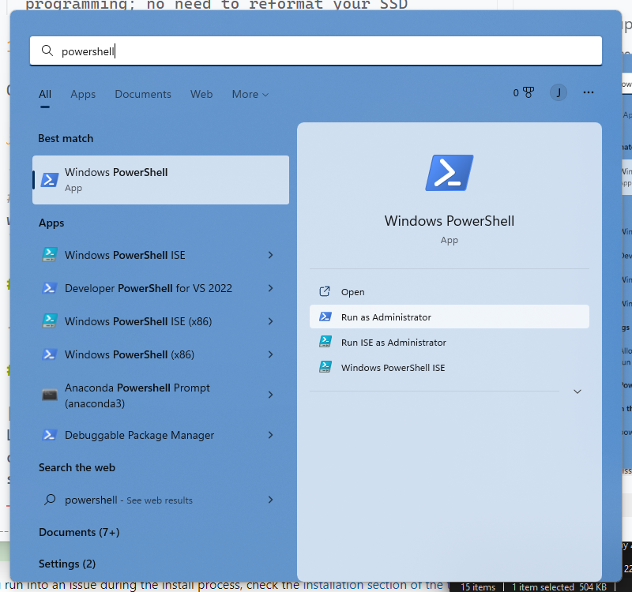
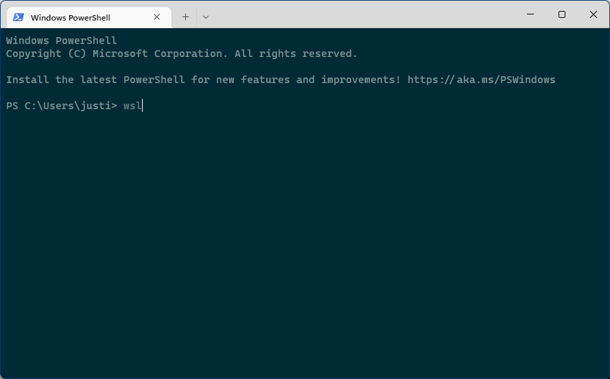
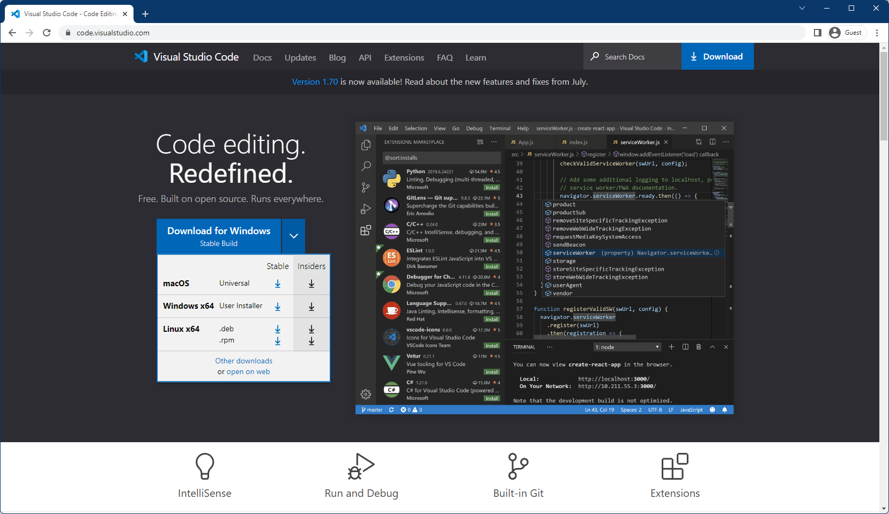
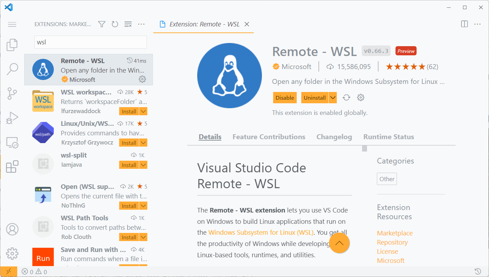
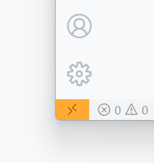
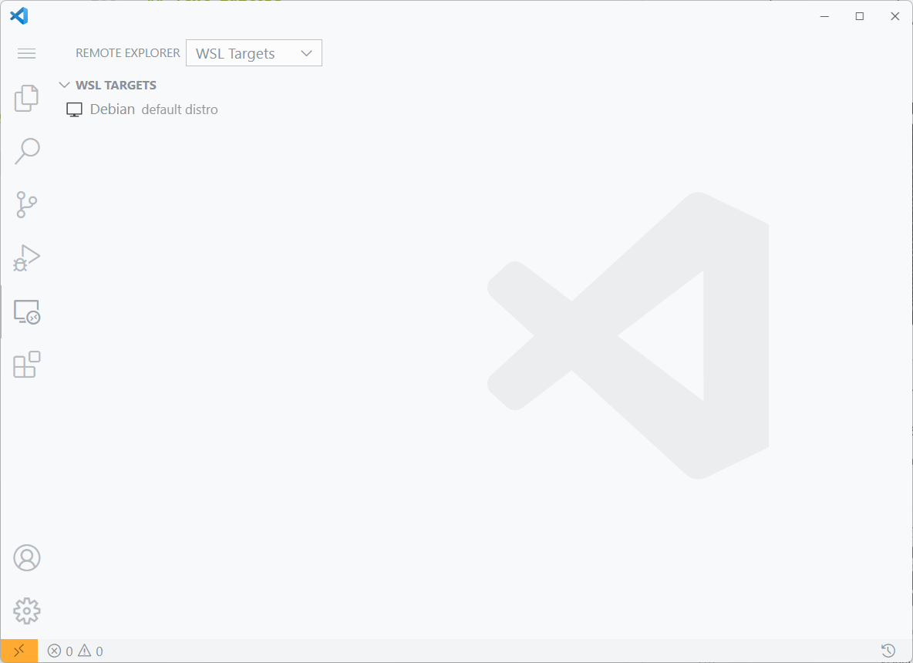
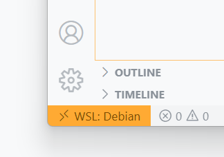

# Setup

- [Introduction](#introduction)
- [Tools](#tools)
  - [WSL for Windows](#wsl-for-windows)
  - [brew for MacOS](#brew-for-macos)
- [Text Editor](#text-editor)
  - [VSCode for Windows Users](#vscode-for-windows-users)
- [Setup Finished (for now)](#setup-finished-for-now)
  - [Themes](#themes)
- [Footnotes](#footnotes)

## Introduction

I'll start by saying **congratulations** for beginning and taking the first step in learning how to program. It's daunting, to say the least, but what in life isn't? Making friends, exercising at the gym, going on runs and hikes, etc. is challenging, but in the long, it is _rewarding_.

I know things will be hard and unfamiliar. Stick with it, and see it through.

It's like painting, or skateboarding, or learning an instrument; at first, you're probably not going to be great at it, but with effort and time, you will be.

I **promise** it will be worthwhile.

---

## Tools

The vast majority of people run either Windows or MacOS on their PC.

For the Windows users, sorry, you're going to have some extra steps to follow.

The reasoning behind this is because programming is **much, much** easier on a Unix-like or Linux machine for a couple of reasons:

- Package management
- Open source and _free_
- Lightweight: fast on slow machines, and faster on fast machines
- Stable
- Tons of tools and documentation online

You don't really need to know why, and this might not make sense now, but trust me on this. Pure Windows is a pain to develop on.

### WSL for Windows

For Windows users, like myself, there is a workaround for using Linux without [dual booting](https://www.freecodecamp.org/news/how-to-dual-boot-any-linux-distribution-with-windows/), unless you want to.[^1]

[wsl](https://docs.microsoft.com/en-us/windows/wsl/install) is Microsoft's way of allowing us to run Linux alongside Windows. `wsl` is known as a **virtual machine**.[^2] Virtualization is software that allows you to _emulate_ computers inside your real computer. You know how people sometimes emulate [Nintendo systems](https://yuzu-emu.org/)? [Same idea](https://www.reddit.com/r/explainlikeimfive/comments/tnv4ww/comment/i23ifs7/?utm_source=share&utm_medium=web2x&context=3).

Here are the highlights:

- You can use your Windows machine as normal
- You don't have to learn a new operating system or graphical interface (_whew_)
- All of your work in `wsl` is **sandboxed**, meaning that if you mess something up badly, you can delete and reinstall a fresh version in minutes
  - Imagine resetting your Windows machine (which takes hours) every time you messed up
  - Along this line, you can delete `wsl` altogether if you decide you're done with programming; no need to reformat your SSD

1. Open up `powershell` from the start menu **as an Administrator**.

   

2. Run the following command.

   By default, the Ubuntu Linux distribution will be downloaded and installed.

   ```powershell
   # Install WSL
   wsl --install
   ```

   **You'll be prompted to restart your machine in between the steps.**

   When you are back, open up WSL in your terminal by calling the command.

   

3. Enter a username and password when prompted.

   

   - For the username:
     - No spaces
     - No uppercase
     - Mine is just _sua_
   - For the password:
     - Doesn't need to be hard to crack
     - Mine is literally 'asdf' so I can enter it quickly

4. You're done!

Go to the [text editor section](#text-editors)

### brew for MacOS

I think Macs are over-hated, to be honest. Every Mac with the M1 chip and higher has been extremely performant, cool, and relatively inexpensive to **any other ultra-book in the market**.[^3]

Anyway, luckily for Mac users, also like myself, there isn't as much work that you need to do.

All that needs to be done is to install a package manager called `brew`.

`brew` will help you easily install, update, and delete packages from the command line. Finding packages from online one-by-one can be very tedious, so tools like `brew` help us out a lot.

Plus, there's a lot of documentation online for `brew` and development on MacOS in general. Macs are also used by many professional programmers.

1. Head over to [brew](https://brew.sh/) and run the command on their page.

   ```bash
   # Also pasted here for convenience
   /bin/bash -c "$(curl -fsSL https://raw.githubusercontent.com/Homebrew/install/HEAD/install.sh)"
   ```

2. You're done!

   Seriously.

<!-- TODO think of more tools to add; however, aim for minimalism for beginners -->

## Text Editor

Now that you're done setting up all the basic tools I can think of, you're going to need a way to write your code.

[Visual Studio Code](https://code.visualstudio.com/) or VSCode is the de-facto standard for text editors.[^4]



Download and install the one matching your operating system.

Mac users, [continue this way](#done); Windows users, read the next section.

### VSCode for Windows Users

Don't worry that my VSCode looks different than yours. I customized mine with themes to make it stand out and expressive of me.

1. The last thing that Windows users need to do is go to the Extensions tab, then download the Remote - WSL extension.

   

2. From now on, launch your VSCode in `wsl`.

   Either click the double caret in the bottom...

   
   

   Or the computer with the double caret in the activity bar, then click your Linux distribution. I have Debian only because I've used it in the past.

   

   You'll know you are in `wsl` when the bottom left corner, double caret icon looks like this.

   

## Setup Finished (for now)

At this point, this is all you really need; plus, your machine is now ready to program!

### Themes

Go personalize your VSCode using the extension tab in the activity bar!!!

Here are customizations that I alternate between. They are all equally loved.

Themes:

- [Ayu](https://marketplace.visualstudio.com/items?itemName=teabyii.ayu) (Light/Dark)
- [Apprentice](https://marketplace.visualstudio.com/items?itemName=amariampolskiy.theme-apprentice) (Dark)
- [Moonlight](https://marketplace.visualstudio.com/items?itemName=atomiks.moonlight) (Dark)
- [Nord](https://marketplace.visualstudio.com/items?itemName=arcticicestudio.nord-visual-studio-code) (Dark)

Icon themes:

- [Material Icon Theme](https://marketplace.visualstudio.com/items?itemName=PKief.material-icon-theme)

Fonts:

- [Fira Code](https://github.com/tonsky/FiraCode)
- [Cascadia Code](https://github.com/microsoft/cascadia-code)
- [Jetbrains Mono](https://www.jetbrains.com/lp/mono/)

---

## Footnotes

[^1]: Dual-booting can be faster because you allow Linux to use all resources like RAM and CPU; with our approach of using a virtual machine, you'll be sharing these resources between the _real_ and _fake_ computer, meaning that things can slow down if your computer is not powerful.
[^2]: You can think of a virtual machine as a fake _computer_ running inside your computer. It has its own operating system, files, and uses the real computer's hardware like memory, storage, and input/output.
[^3]: [https://www.laptopmag.com/features/why-is-everyone-so-excited-about-the-m1-macbooks](https://www.laptopmag.com/features/why-is-everyone-so-excited-about-the-m1-macbooks)
[^4]: [https://survey.stackoverflow.co/2022/#section-most-popular-technologies-integrated-development-environment](https://survey.stackoverflow.co/2022/#section-most-popular-technologies-integrated-development-environment)
